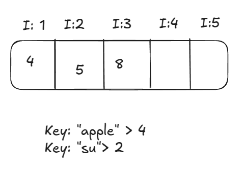
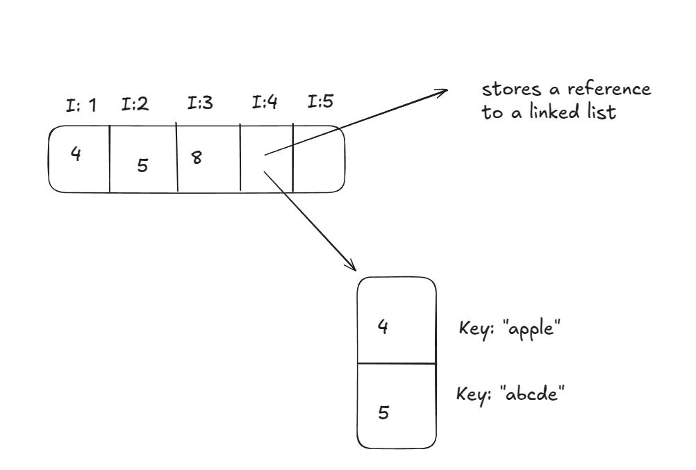

# Simple hashmap
The idea behind this project is to implement a simple hashmap

### What is a hashmap?
Hashmap are a type of data structure based on list, where we map a string value to a index number of that list. For example:
<p align="center">
    
</p>
However, we need to think about many problems that this generate:
- Collisions, two different keys give the same index

```
key("apple") -> index 4
key("abcde") -> index 4
```
And due to the colission problem, another problem occur, which is dynamic allocation for the hashmap, because when a collision happen, we do this:
<p align="center">
    
</p>

and storing linkedlist in an array to store two keys with the same index, its ok but takes out the advantage of the fast read we got in arrays, so its wise to avoid collisions as much as possible

### How is it useful in programming?
- TO DO
